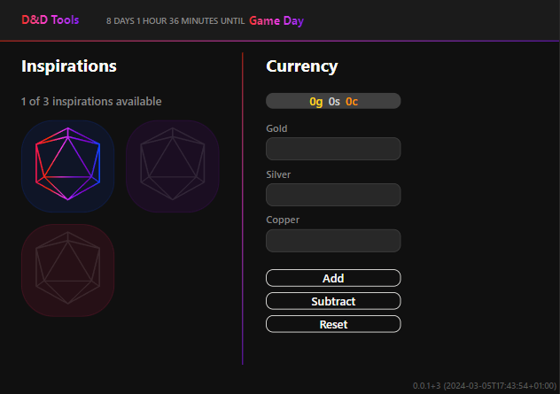

# D&D Tools

This project was generated with [Angular CLI](https://github.com/angular/angular-cli) version 17.2.1.

**Table of contents:**

1. [Todo](#todo)
2. [Useful commands](#useful-commands)
    1. [Development server](#development-server)
    2. [Code scaffolding](#code-scaffolding)
    3. [Build](#build)
    4. [Running unit tests](#running-unit-tests)
    5. [Running end-to-end tests](#running-end-to-end-tests)
    6. [Running lint](#running-lint)
    7. [Further help](#further-help)
    8. [Deploy project as GitHub Page](#deploy-project-as-github-page)

## Todo

For open to do have a look at [TODO](TODO.md)

## Useful commands

### Development server

Run `npm run dev` for a dev server. Navigate to `http://localhost:4200/`. The application will automatically reload if you change any of the source files.

### Code scaffolding

Run `ng generate component component-name` to generate a new component. You can also use `ng generate directive|pipe|service|class|guard|interface|enum|module`.

### Build

Run `npm run build` to build the project. The build artifacts will be stored in the `dist/` directory.

### Running unit tests

Run `npm run test` to execute the unit tests via [Karma](https://karma-runner.github.io).

### Running end-to-end tests

Run `ng e2e` to execute the end-to-end tests via a platform of your choice. To use this command, you need to first add a package that implements end-to-end testing capabilities.

### Running lint

Run `npm run lint` to lint the project via [ESLint](https://eslint.org/).

### Further help

To get more help on the Angular CLI use `ng help` or go check out the [Angular CLI Overview and Command Reference](https://angular.io/cli) page.

### Deploy project as GitHub Page

Run `npm run publish` to build, version and deploy the project.
This is done with [angular-cli-ghpages](https://github.com/angular-schule/angular-cli-ghpages/#readme).
